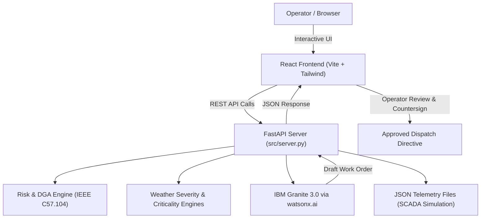

# ⚡ GridSentinel AI: Outage Prediction & Equipment Failure Copilot

An AI-powered decision-support platform that predicts high-voltage transformer failure risks and generates emergency crew pre-positioning recommendations before severe weather events.

> **Project Status:** Hackathon prototype using simulated transformer telemetry and weather data. It is not intended for direct control of real electrical infrastructure.

---

## 👥 Team

| Field | Details |
|---|---|
| **Team Name** | Team Mantra |
| **Track** | AI |
| **Team Lead** | Mahek Dhebariya — [24cs018@charusat.edu.in](mailto:24cs018@charusat.edu.in) |
| **Member 1** | Khushi Ka.Patel — [24cs032@charusat.edu.in](mailto:24cs032@charusat.edu.in) |
| **Member 2** | Palak Donga — [24cs020@charusat.edu.in](mailto:24cs020@charusat.edu.in) |
| **Member 3** | Yashvi Antala — [24cs006@charusat.edu.in](mailto:24cs006@charusat.edu.in) |

---

## 🎯 Problem Statement

Power transformer and substation failures can cause unexpected blackouts, damage critical infrastructure, and create substantial operational and financial losses for utility providers.

Traditional maintenance processes often depend on fixed calendar schedules and manual inspections. As a result, early warning signals such as:

- Abnormal dissolved gas levels
- Increasing oil temperature
- Transformer vibration spikes
- Excessive electrical loading
- Weather-related stress
- Repeated equipment incidents

may go undetected until serious equipment damage occurs.

Severe weather events, including heatwaves, storms, lightning, and strong winds, can increase stress on already vulnerable equipment.

Utility operators need a system that can:

1. Detect transformer health risks early.
2. Combine equipment health with weather conditions.
3. Prioritize substations according to operational importance.
4. Recommend preventive maintenance actions.
5. Support emergency crew and spare-parts preparation.
6. Generate clear and explainable operational work orders.

---

## 💡 Proposed Solution

**GridSentinel AI** is an intelligent grid monitoring and decision-support application that combines deterministic engineering rules with generative AI.

The platform analyzes simulated transformer health telemetry, weather conditions, and grid criticality data to calculate an overall risk score. It then uses **IBM Granite 3.0** through **IBM watsonx.ai** to convert analytical results into an explainable emergency response and crew pre-positioning plan.

### Core Workflow

1. **Ingest** transformer telemetry and weather data.
2. **Analyze** dissolved gas and equipment health indicators.
3. **Calculate** transformer failure risk.
4. **Apply** weather severity factors.
5. **Prioritize** substations according to grid criticality.
6. **Recommend** maintenance and crew pre-positioning actions.
7. **Generate** an explainable work-order draft using IBM Granite.
8. **Allow** a human operator to review and approve the recommendation.

> ⚠️ **Important:** GridSentinel AI provides recommendations only. It does not automatically control substations, disconnect power, or execute load-shedding operations.

---

## ✨ Key Features

### 1. Transformer Health Monitoring

Tracks important transformer health indicators, including:

- Hydrogen
- Methane
- Ethane
- Ethylene
- Acetylene
- Oil temperature
- Vibration level
- Electrical load
- Previous fault history

### 2. Dissolved Gas Analysis Engine

The Dissolved Gas Analysis, or **DGA**, engine applies configurable rule-based checks inspired by transformer diagnostic practices.

It identifies possible conditions such as:

- Thermal stress
- Electrical discharge
- Possible arcing
- Abnormal gas accumulation
- Overheating-related conditions

> The DGA thresholds used in this prototype are simplified and configurable. They are not a replacement for a complete certified transformer diagnostic assessment.

### 3. Dynamic Weather Severity Multiplier

Combines equipment health risk with weather conditions such as:

- Ambient temperature
- Wind gusts
- Lightning activity
- Storm severity
- Heatwave alerts

Severe weather increases the priority of vulnerable transformers and substations.

### 4. Grid Criticality Scoring

The system calculates a grid criticality score between **0 and 100** using simulated operational factors such as:

- Population served
- Hospital connectivity
- Water-treatment connectivity
- Public transportation connectivity
- Number of connected customers
- Historical outage impact
- Downstream infrastructure

Higher scores indicate that an asset may require more urgent attention.

### 5. Risk Ranking Dashboard

The dashboard categorizes assets using the following prototype risk ranges:

| Risk Score | Category | Suggested Action |
|---:|---|---|
| `0–39` | Low | Continue monitoring |
| `40–69` | Medium | Schedule inspection |
| `70–100` | High | Prioritize urgent assessment |

These ranges can be adjusted according to utility requirements.

### 6. IBM Granite Work-Order Generation

IBM Granite generates an explainable work-order draft based on the analytical results.

The generated recommendation may include:

- Transformer or substation identifier
- Detected risk factors
- Inspection priority
- Suggested crew staging location
- Required spare parts
- Suggested diagnostic equipment
- Maintenance preparation steps
- Weather-related precautions
- Human approval requirements

### 7. Interactive Diagnostic Dashboard

The React + Vite single-page dashboard provides:

- High-level KPI metric cards (active assets, critical alerts, weather severity factor, critical customer load)
- Animated risk score gauges and severity badges (Critical, High, Medium, Low)
- Filterable and sortable transformer fleet matrix
- Expandable IEEE C57.104 DGA gas breakdown (H2, CH4, C2H6, C2H4, C2H2)
- Dynamic weather severity and compounding multiplier panel
- Grid criticality infrastructure impact view (hospitals, water treatment, rail transit)
- Interactive IBM Granite 3.0 emergency work-order dispatch drawer
- Human-in-the-loop countersign approval workflow and exportable directives

---

## 🧠 IBM Technology Integration

| IBM Technology | Purpose |
|---|---|
| **IBM BoB IDE** | AI-assisted development, architecture planning, code generation, debugging, and project iteration |
| **IBM watsonx.ai** | Generative AI model inference and integration |
| **IBM Granite 3.0** | Generation of explainable operational recommendations and crew staging work-order drafts |

The project separates numerical analysis from generative AI:

1. Deterministic application logic calculates health, weather, and criticality scores.
2. IBM Granite explains the results and prepares a human-readable response plan.
3. A human operator reviews the recommendation before any operational action.

---

## 🛠️ Technology Stack

| Category | Technologies |
|---|---|
| **Programming Languages** | Python 3.10+, JavaScript / TypeScript |
| **Backend Framework** | FastAPI, Uvicorn, Pydantic |
| **Frontend Framework** | React 18, Vite, Tailwind CSS, Lucide Icons |
| **Data Processing** | Pandas |
| **Visualization** | Recharts, SVG Gauges |
| **AI Development Environment** | IBM BoB IDE |
| **Generative AI** | IBM watsonx.ai and IBM Granite 3.0 |
| **Data Storage** | JSON structured telemetry files |
| **Version Control** | Git and GitHub |
| **Validation and CI** | GitHub Actions |
| **Documentation** | Markdown and Mermaid |

---

## 🏗️ System Architecture



---

## 📁 Repository Structure

```text
bob-ai-hackathon-Team-Mantra/
│
├── frontend/                     ← React 18 + Vite single-page dashboard
│   ├── src/
│   │   ├── components/           ← KPI cards, Asset table, Modal, Gauges
│   │   ├── App.jsx               ← Main interactive dashboard view
│   │   └── index.css             ← Tailwind CSS styling
│   ├── package.json
│   └── vite.config.js
│
├── src/                          ← Backend API and analytical engines
│   ├── server.py                 ← FastAPI application and REST endpoints
│   ├── dga_engine.py             ← IEEE C57.104 dissolved gas analysis
│   ├── weather_engine.py         ← Meteorological compounding multiplier
│   ├── criticality_engine.py     ← Substation grid impact scoring
│   ├── risk_engine.py            ← Composite risk ranking engine
│   ├── work_order_generator.py   ← IBM Granite 3.0 watsonx.ai integration
│   ├── data/                     ← Simulated SCADA telemetry datasets
│   │   ├── transformer_telemetry.json
│   │   ├── weather_data.json
│   │   └── grid_criticality.json
│   └── requirements.txt          ← Python dependencies
│
├── docs/                         ← Hackathon documentation
│   ├── problem-statement.md
│   ├── solution-overview.md
│   ├── architecture.md
│   └── setup-guide.md
│
├── demo/                         ← Video and deployed demo links
│   ├── screenshots/
│   ├── demo-video-link.txt
│   └── live-demo-url.txt
│
├── presentation/                 ← Hackathon presentation deck
│   └── slides.pdf
│
├── submission.yaml               ← Hackathon evaluation metadata
└── README.md                     ← Project documentation entry point
```

---

## 🚀 How to Run

### 1. Clone the Repository

```bash
git clone https://github.com/mahek1907/bob-ai-hackathon-Team-Mantra.git
cd bob-ai-hackathon-Team-Mantra
```

### 2. Backend Setup (FastAPI)

```bash
# Create and activate virtual environment
python -m venv venv

# Windows
.\venv\Scripts\activate
# Linux/macOS: source venv/bin/activate

# Install backend dependencies
pip install -r src/requirements.txt

# Start the FastAPI backend server
uvicorn src.server:app --reload --port 8000
```

The API will be available at `http://localhost:8000` (API documentation at `http://localhost:8000/docs`).

### 3. Frontend Setup (React + Vite)

In a separate terminal:

```bash
cd frontend
npm install
npm run dev
```

The interactive dashboard will open at `http://localhost:5173`.

---

## 📦 Dependencies

The backend requirements (`src/requirements.txt`):

```text
fastapi>=0.110.0
uvicorn>=0.28.0
pydantic>=2.6.0
python-dotenv>=1.0.0
pandas>=2.0.0
pytest>=8.0.0
ibm-watsonx-ai>=1.0.0
```

Additional IBM SDK or API dependencies may be required depending on the selected IBM watsonx.ai integration method.

---

## 🖥️ Demo

| Artifact | Location |
|---|---|
| 📹 Demo Video | `demo/demo-video-link.txt` |
| 🌐 Live Demo | `demo/live-demo-url.txt` |
| 🖼️ Screenshots | `demo/screenshots/` |
| 📊 Presentation | `presentation/slides.pdf` |

### Suggested Demonstration Flow

1. Open the GridSentinel AI dashboard.
2. Display transformer health information.
3. Select a transformer with abnormal telemetry.
4. Show the DGA-based warning.
5. Apply a severe weather scenario.
6. Display the updated risk score.
7. Show the substation criticality ranking.
8. Generate a crew pre-positioning work-order draft.
9. Review the recommendation as a utility operator.
10. Export the diagnostic report.

---

## 🔍 Example Use Case

A severe storm is expected to affect a region containing several substations.

One transformer already shows:

- Increased oil temperature
- Abnormal dissolved gas readings
- High loading percentage
- Elevated vibration
- Previous maintenance issues

GridSentinel AI processes the available data and identifies the transformer as high risk.

The weather engine then increases the priority because strong winds and high temperatures are expected.

The criticality engine identifies that the substation serves important infrastructure.

The system generates a recommendation that may include:

- Inspecting the transformer before the storm
- Pre-positioning an emergency maintenance crew
- Preparing suitable diagnostic equipment
- Verifying spare-part availability
- Increasing transformer monitoring frequency
- Requiring operator approval before any action

---

## 🔐 Safety and Responsible AI

GridSentinel AI is designed as a decision-support prototype.

The application:

- Does not directly control electrical equipment.
- Does not automatically disconnect power.
- Does not execute load-shedding actions.
- Does not replace certified electrical engineers.
- Does not guarantee that a transformer will fail.
- Requires human review before operational decisions.
- Uses simulated or batch-processed data for demonstration.

A real-world deployment would require:

- Utility-specific validation
- Certified engineering review
- Secure telemetry ingestion
- SCADA and IEC 61850 integration
- Cybersecurity testing
- Model validation
- Regulatory approval
- Human-in-the-loop operational procedures

---

## ⚠️ Known Limitations

### 1. Batch Telemetry Ingestion

The current prototype processes JSON telemetry files instead of continuously receiving high-frequency SCADA or IEC 61850 streams.

### 2. Simulated Data

The demonstration uses simulated or prepared datasets. The system has not been validated against a utility's historical transformer failure records.

### 3. Simplified DGA Rules

The DGA engine uses configurable prototype rules and does not provide a complete transformer diagnostic assessment.

### 4. Weather Data

The current version may use prepared weather scenarios instead of a continuously updated meteorological API.

### 5. Limited Grid Topology

Grid criticality is calculated from structured demonstration data and does not represent a live utility network.

### 6. No Automatic Dispatch

The system generates a work-order draft. It does not automatically dispatch crews or reserve equipment.

### 7. Limited Physical Modeling

Detailed transformer thermal modeling, transmission-line sag modeling, dynamic line rating, and complete power-flow simulation are outside the current prototype scope.

---

## 🚧 Future Enhancements

Future versions may include:

- Real-time SCADA and IEC 61850 integration
- Live weather API integration
- Historical transformer failure dataset training
- Advanced time-series forecasting
- Explainable machine learning models
- Digital twin integration
- Real-time grid topology analysis
- Dynamic line rating analysis
- Crew routing optimization
- Mobile application for field engineers
- Role-based access control
- AI recommendation audit logs
- Integration with enterprise maintenance systems
- Human feedback-based model improvement

---

## 🏅 What We Are Most Proud Of

We are proud of combining classical engineering-based transformer diagnostics with generative AI.

Instead of using AI as a generic chatbot, GridSentinel AI follows a two-stage approach:

1. **Deterministic analysis:** Calculates transformer health, weather risk, and grid criticality using transparent application logic.
2. **Generative AI assistance:** Uses IBM Granite to explain the results and generate a structured, human-readable work-order draft.

This approach makes the prototype more explainable, practical, and suitable for human review.

---

## 📚 Engineering Reference

The project uses dissolved gas analysis concepts inspired by:

- IEEE C57.104 transformer dissolved gas analysis guidance
- Transformer health monitoring practices
- Preventive maintenance workflows
- Weather-related equipment risk assessment

The prototype is intended for educational and hackathon demonstration purposes. It should not be considered a certified engineering diagnostic tool.

---

## 📄 License

This project was developed for the IBM BoB AI Innovation Hackathon by **Team Mantra**.

Add an appropriate open-source license if the team decides to publish the project under an open-source license.

---

## 🤝 Acknowledgements

- IBM BoB IDE
- IBM watsonx.ai
- IBM Granite
- IBM BoB AI Innovation Hackathon
- Python community
- Streamlit community
- Pandas community
- Plotly community
