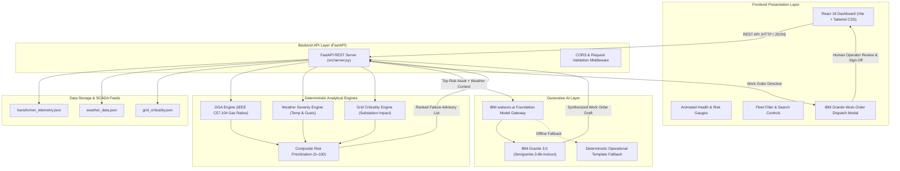

# Architecture — GridSentinel AI

## System Architecture

GridSentinel AI is architected as a decoupled, modern cloud-native system separating deterministic physics-based heuristics from generative AI orchestration. The user interacts through a reactive single-page dashboard built in React 18, which communicates with a high-performance Python FastAPI backend. The backend executes multi-source data ingestion, IEEE C57.104 dissolved gas analysis (DGA), meteorological compounding risk calculations, and invokes IBM Granite 3.0 via IBM watsonx.ai for operational work-order generation.

---

## Components

| Component | Technology | Responsibility |
|---|---|---|
| **Frontend Presentation** | React 18, Vite, Tailwind CSS, Lucide Icons | Responsive single-page dashboard, animated risk score gauges, fleet filtering, expandable DGA gas telemetry, and interactive dispatch modal. |
| **Backend API** | FastAPI, Uvicorn, Pydantic | RESTful API server, request validation, CORS management, data aggregation, and orchestration of analytical engines. |
| **DGA Diagnostic Engine** | Python (`src/dga_engine.py`) | IEEE C57.104 Dissolved Gas Analysis. Evaluates ppm thresholds and gas ratios (Hydrogen, Methane, Ethane, Ethylene, Acetylene) to detect arcing, partial discharge, and thermal runaway. |
| **Weather Severity Engine** | Python (`src/weather_engine.py`) | Meteorological stress evaluation. Analyzes ambient temperatures, wind gusts, and lightning activity to compute dynamic risk compounding multipliers (1.0× to 1.5×). |
| **Grid Criticality Engine** | Python (`src/criticality_engine.py`) | Substation operational priority scoring (0–100) factoring hospital connections, electrified rail transit, municipal water facilities, and population served. |
| **Composite Risk Engine** | Python (`src/risk_engine.py`) | Multi-variable weighted risk synthesis (60% physical health, 20% weather stress, 20% grid criticality) generating ranked failure advisories. |
| **Generative Work-Order Copilot** | IBM Granite 3.0 via IBM watsonx.ai (`src/work_order_generator.py`) | Synthesizes explainable emergency crew pre-positioning directives, staging depot assignments, diagnostic tool requirements, and safety checklists. |
| **Data Layer** | Structured JSON (`src/data/`) | Simulated substation SCADA telemetry, ambient meteorological observations, and regional grid topology metadata. |

---

## Data Flow

1. **SCADA & Weather Ingestion:** The FastAPI backend ingests transformer telemetry (`transformer_telemetry.json`), real-time weather metrics (`weather_data.json`), and substation topology records (`grid_criticality.json`).
2. **Deterministic Diagnostic Evaluation:**
   - The DGA engine calculates a physical health index ($0-100$) and diagnoses active fault conditions (e.g., *Active High-Energy Arcing*, *Severe Thermal Runaway*).
   - The weather engine determines the environmental compounding factor ($1.0\times-1.5\times$).
   - The grid criticality engine scores downstream societal dependency ($0-100$).
3. **Composite Risk Synthesis:** The composite risk engine fuses physical health, weather risk, and societal impact into a weighted score ($0-100$) and categorizes assets into **Low**, **Medium**, **High**, or **Critical** priority.
4. **Client Visualization:** The React dashboard fetches the ranked fleet status via `GET /api/risk/ranked`, rendering interactive risk gauges, alert cards, and filterable asset tables.
5. **Generative Work-Order Synthesis:** When an operator clicks "Generate Dispatch Directive" on a vulnerable transformer, the frontend requests `POST /api/work-order/generate`. The backend constructs a structured prompt and calls IBM Granite 3.0 on IBM watsonx.ai (or falls back to high-fidelity offline templates if unauthenticated).
6. **Human-in-the-Loop Sign-Off:** The generated directive is displayed in an interactive slide-over drawer where the operator reviews staging depots, required spare parts, and mandatory safety notices before digitally countersigning the work order.

---

## Security Considerations

- **API Credentials Isolation:** IBM watsonx.ai credentials (`WATSONX_API_KEY`, `WATSONX_PROJECT_ID`, `WATSONX_URL`) are loaded from environment variables via `python-dotenv` and are never exposed to the client or committed to version control.
- **Cross-Origin Resource Sharing (CORS):** The FastAPI backend restricts allowed origins to designated frontend development and production hosts (`http://localhost:5173`, `http://127.0.0.1:5173`).
- **Input Validation:** All API request payloads and telemetry models are validated using Pydantic schemas to prevent malformed or injection attacks.
- **Fail-Safe Offline Mode:** In environments without internet or watsonx.ai credentials, the system gracefully falls back to deterministic IEEE-compliant advisory templates without breaking or leaking error traces.

---

## Scalability Notes

- **Horizontal API Scaling:** The FastAPI backend is completely stateless and can scale horizontally across multiple container instances (e.g., Kubernetes, Red Hat OpenShift, IBM Cloud Code Engine) behind an ingress load balancer.
- **Real-Time Stream Ingestion:** In production utility environments, batch JSON feeds can be replaced with continuous Apache Kafka or MQTT message brokers ingesting IEC 61850 Substation SCADA and dynamic line rating (DLR) sensors.
- **Caching & Caching Layer:** High-frequency risk calculations and generated Granite work orders can be cached in Redis with short TTLs to minimize redundant LLM inference costs during regional emergencies.
